# UML Use Case Diagram Elements - CE Study Assistant

---

## 1. ACTORS

| Actor Name | Type | Description |
|------------|------|-------------|
| **Guest** | Primary | Unauthenticated visitor who can access landing page and initiate login |
| **Student** | Primary | Registered user who uses study features (chat, upload, quizzes, revision, exams) |
| **Admin** | Primary | Elevated user who manages users, views stats, uploads syllabus |
| **Google OAuth Provider** | Secondary | External system providing authentication via Google accounts |
| **Gemini AI Service** | Secondary | External AI service for chat, flashcard, MCQ, and exam question generation |
| **ChromaDB** | Secondary | Vector database service for document embeddings and RAG retrieval |

---

## 2. USE CASES

### Authentication Module

| Use Case ID | Use Case Name | Description | Actor(s) |
|-------------|---------------|-------------|----------|
| UC-001 | Login via Google OAuth | User authenticates through Google account | Guest |
| UC-002 | Login via Developer Bypass | Auto-login when Google Client ID not configured | Guest |
| UC-003 | Logout | User ends session, cookie cleared | Student, Admin |
| UC-004 | View Profile | User fetches current user data from /auth/me | Student, Admin |
| UC-005 | Setup Profile (Onboard) | User provides first_name, last_name, college, semester | Student |

### Chat Module

| Use Case ID | Use Case Name | Description | Actor(s) |
|-------------|---------------|-------------|----------|
| UC-006 | Send Chat Message | User sends message, receives AI response | Student |
| UC-007 | View Chat Sessions | User lists all chat sessions | Student |
| UC-008 | View Session Messages | User retrieves messages for a specific session | Student |
| UC-009 | Delete Chat Session | User removes a chat session and its messages | Student |

### Upload Module

| Use Case ID | Use Case Name | Description | Actor(s) |
|-------------|---------------|-------------|----------|
| UC-010 | Upload PDF | User uploads PDF file for parsing and embedding | Student |
| UC-011 | View Uploaded Documents | User lists all uploaded PDFs with status | Student |
| UC-012 | Delete Uploaded Document | User removes upload, embeddings, and physical file | Student |
| UC-013 | Retry Embedding | User re-triggers embedding for failed document | Student |

### Generation Module

| Use Case ID | Use Case Name | Description | Actor(s) |
|-------------|---------------|-------------|----------|
| UC-014 | Generate Flashcards | User generates flashcards from uploaded document | Student |
| UC-015 | Generate MCQs | User generates multiple choice questions (max 2 per PDF) | Student |
| UC-016 | Generate Exam Questions | User generates probable exam questions | Student |
| UC-017 | Check Embedding Status | User views embedding status for a document | Student |
| UC-018 | Manually Trigger Embedding | User initiates embedding for a document | Student |
| UC-019 | View Saved MCQs | User retrieves previously generated MCQ sets | Student |

### Quiz Module

| Use Case ID | Use Case Name | Description | Actor(s) |
|-------------|---------------|-------------|----------|
| UC-020 | Generate Quiz | User creates quiz on a topic | Student |
| UC-021 | View Quiz History | User lists past quizzes with scores | Student |

### Revision Planner Module

| Use Case ID | Use Case Name | Description | Actor(s) |
|-------------|---------------|-------------|----------|
| UC-022 | Create Revision Plan | User schedules a revision with title, date, priority | Student |
| UC-023 | View Revision Plans | User lists all revision plans | Student |
| UC-024 | Update Revision Plan | User modifies plan details | Student |
| UC-025 | Delete Revision Plan | User removes a revision plan | Student |
| UC-026 | Mark Plan Status | User toggles plan between pending/completed | Student |

### Exam Module

| Use Case ID | Use Case Name | Description | Actor(s) |
|-------------|---------------|-------------|----------|
| UC-027 | Create Exam | User adds exam with type (ut/assessment/final), subject, date | Student |
| UC-028 | View Exams | User lists all upcoming exams | Student |
| UC-029 | Delete Exam | User removes an exam entry | Student |

### Admin Module

| Use Case ID | Use Case Name | Description | Actor(s) |
|-------------|---------------|-------------|----------|
| UC-030 | View All Users | Admin fetches complete user list | Admin |
| UC-031 | Ban/Unban User | Admin toggles user ban status with reason | Admin |
| UC-032 | View System Stats | Admin sees total users, active sessions, DB health | Admin |
| UC-033 | Upload Syllabus | Admin uploads syllabus for RAG embeddings | Admin |

---

## 3. ASSOCIATION RELATIONSHIPS

| Association ID | Actor | Use Case | Direction |
|----------------|-------|----------|-----------|
| ASC-001 | Guest | UC-001 Login via Google OAuth | Guest → UC-001 |
| ASC-002 | Guest | UC-002 Login via Developer Bypass | Guest → UC-002 |
| ASC-003 | Student | UC-003 Logout | Student → UC-003 |
| ASC-004 | Student | UC-004 View Profile | Student → UC-004 |
| ASC-005 | Student | UC-005 Setup Profile | Student → UC-005 |
| ASC-006 | Student | UC-006 Send Chat Message | Student → UC-006 |
| ASC-007 | Student | UC-007 View Chat Sessions | Student → UC-007 |
| ASC-008 | Student | UC-008 View Session Messages | Student → UC-008 |
| ASC-009 | Student | UC-009 Delete Chat Session | Student → UC-009 |
| ASC-010 | Student | UC-010 Upload PDF | Student → UC-010 |
| ASC-011 | Student | UC-011 View Uploaded Documents | Student → UC-011 |
| ASC-012 | Student | UC-012 Delete Uploaded Document | Student → UC-012 |
| ASC-013 | Student | UC-013 Retry Embedding | Student → UC-013 |
| ASC-014 | Student | UC-014 Generate Flashcards | Student → UC-014 |
| ASC-015 | Student | UC-015 Generate MCQs | Student → UC-015 |
| ASC-016 | Student | UC-016 Generate Exam Questions | Student → UC-016 |
| ASC-017 | Student | UC-017 Check Embedding Status | Student → UC-017 |
| ASC-018 | Student | UC-018 Manually Trigger Embedding | Student → UC-018 |
| ASC-019 | Student | UC-019 View Saved MCQs | Student → UC-019 |
| ASC-020 | Student | UC-020 Generate Quiz | Student → UC-020 |
| ASC-021 | Student | UC-021 View Quiz History | Student → UC-021 |
| ASC-022 | Student | UC-022 Create Revision Plan | Student → UC-022 |
| ASC-023 | Student | UC-023 View Revision Plans | Student → UC-023 |
| ASC-024 | Student | UC-024 Update Revision Plan | Student → UC-024 |
| ASC-025 | Student | UC-025 Delete Revision Plan | Student → UC-025 |
| ASC-026 | Student | UC-026 Mark Plan Status | Student → UC-026 |
| ASC-027 | Student | UC-027 Create Exam | Student → UC-027 |
| ASC-028 | Student | UC-028 View Exams | Student → UC-028 |
| ASC-029 | Student | UC-029 Delete Exam | Student → UC-029 |
| ASC-030 | Admin | UC-003 Logout | Admin → UC-003 |
| ASC-031 | Admin | UC-004 View Profile | Admin → UC-004 |
| ASC-032 | Admin | UC-030 View All Users | Admin → UC-030 |
| ASC-033 | Admin | UC-031 Ban/Unban User | Admin → UC-031 |
| ASC-034 | Admin | UC-032 View System Stats | Admin → UC-032 |
| ASC-035 | Admin | UC-033 Upload Syllabus | Admin → UC-033 |
| ASC-036 | Google OAuth Provider | UC-001 Login via Google OAuth | UC-001 ↔ Google OAuth |
| ASC-037 | Gemini AI Service | UC-006 Send Chat Message | UC-006 ↔ Gemini AI |
| ASC-038 | Gemini AI Service | UC-014 Generate Flashcards | UC-014 ↔ Gemini AI |
| ASC-039 | Gemini AI Service | UC-015 Generate MCQs | UC-015 ↔ Gemini AI |
| ASC-040 | Gemini AI Service | UC-016 Generate Exam Questions | UC-016 ↔ Gemini AI |
| ASC-041 | ChromaDB | UC-010 Upload PDF | UC-010 ↔ ChromaDB |
| ASC-042 | ChromaDB | UC-014 Generate Flashcards | UC-014 ↔ ChromaDB |
| ASC-043 | ChromaDB | UC-015 Generate MCQs | UC-015 ↔ ChromaDB |
| ASC-044 | ChromaDB | UC-016 Generate Exam Questions | UC-016 ↔ ChromaDB |

---

## 4. INCLUDE RELATIONSHIPS

| Include ID | Base Use Case | Included Use Case | Description |
|------------|---------------|-------------------|-------------|
| INC-001 | UC-003 Logout | UC-004 View Profile | Must verify user is logged in before logout |
| INC-002 | UC-005 Setup Profile | UC-004 View Profile | Must fetch current user data during onboarding |
| INC-003 | UC-006 Send Chat Message | UC-004 View Profile | Must authenticate user before sending message |
| INC-004 | UC-006 Send Chat Message | UC-010 Upload PDF (context) | Must load uploaded materials for RAG context |
| INC-005 | UC-007 View Chat Sessions | UC-004 View Profile | Must authenticate user to list sessions |
| INC-006 | UC-008 View Session Messages | UC-004 View Profile | Must authenticate user to view messages |
| INC-007 | UC-009 Delete Chat Session | UC-004 View Profile | Must authenticate user before deletion |
| INC-008 | UC-010 Upload PDF | UC-004 View Profile | Must authenticate user before upload |
| INC-009 | UC-011 View Uploaded Documents | UC-004 View Profile | Must authenticate user to list uploads |
| INC-010 | UC-012 Delete Uploaded Document | UC-004 View Profile | Must authenticate user before deletion |
| INC-011 | UC-012 Delete Uploaded Document | UC-010 Upload PDF | Must verify upload exists and belongs to user |
| INC-012 | UC-013 Retry Embedding | UC-004 View Profile | Must authenticate user before retry |
| INC-013 | UC-013 Retry Embedding | UC-010 Upload PDF | Must verify upload exists and belongs to user |
| INC-014 | UC-014 Generate Flashcards | UC-004 View Profile | Must authenticate user before generation |
| INC-015 | UC-014 Generate Flashcards | UC-010 Upload PDF | Must verify upload exists and belongs to user |
| INC-016 | UC-014 Generate Flashcards | UC-018 Manually Trigger Embedding | Must ensure document is embedded before generation |
| INC-017 | UC-015 Generate MCQs | UC-004 View Profile | Must authenticate user before generation |
| INC-018 | UC-015 Generate MCQs | UC-010 Upload PDF | Must verify upload exists and belongs to user |
| INC-019 | UC-015 Generate MCQs | UC-018 Manually Trigger Embedding | Must ensure document is embedded before generation |
| INC-020 | UC-016 Generate Exam Questions | UC-004 View Profile | Must authenticate user before generation |
| INC-021 | UC-016 Generate Exam Questions | UC-010 Upload PDF | Must verify upload exists and belongs to user |
| INC-022 | UC-016 Generate Exam Questions | UC-018 Manually Trigger Embedding | Must ensure document is embedded before generation |
| INC-023 | UC-017 Check Embedding Status | UC-004 View Profile | Must authenticate user to check status |
| INC-024 | UC-017 Check Embedding Status | UC-010 Upload PDF | Must verify upload exists and belongs to user |
| INC-025 | UC-018 Manually Trigger Embedding | UC-004 View Profile | Must authenticate user before triggering |
| INC-026 | UC-018 Manually Trigger Embedding | UC-010 Upload PDF | Must verify upload exists and belongs to user |
| INC-027 | UC-019 View Saved MCQs | UC-004 View Profile | Must authenticate user to view MCQs |
| INC-028 | UC-019 View Saved MCQs | UC-010 Upload PDF | Must verify upload exists and belongs to user |
| INC-029 | UC-020 Generate Quiz | UC-004 View Profile | Must authenticate user before generation |
| INC-030 | UC-021 View Quiz History | UC-004 View Profile | Must authenticate user to list history |
| INC-031 | UC-022 Create Revision Plan | UC-004 View Profile | Must authenticate user before creation |
| INC-032 | UC-023 View Revision Plans | UC-004 View Profile | Must authenticate user to list plans |
| INC-033 | UC-024 Update Revision Plan | UC-004 View Profile | Must authenticate user before update |
| INC-034 | UC-024 Update Revision Plan | UC-022 Create Revision Plan | Must verify plan exists and belongs to user |
| INC-035 | UC-025 Delete Revision Plan | UC-004 View Profile | Must authenticate user before deletion |
| INC-036 | UC-025 Delete Revision Plan | UC-022 Create Revision Plan | Must verify plan exists and belongs to user |
| INC-037 | UC-026 Mark Plan Status | UC-004 View Profile | Must authenticate user before status change |
| INC-038 | UC-026 Mark Plan Status | UC-022 Create Revision Plan | Must verify plan exists and belongs to user |
| INC-039 | UC-027 Create Exam | UC-004 View Profile | Must authenticate user before creation |
| INC-040 | UC-028 View Exams | UC-004 View Profile | Must authenticate user to list exams |
| INC-041 | UC-029 Delete Exam | UC-004 View Profile | Must authenticate user before deletion |
| INC-042 | UC-029 Delete Exam | UC-027 Create Exam | Must verify exam exists and belongs to user |
| INC-043 | UC-030 View All Users | UC-004 View Profile | Must authenticate admin before viewing users |
| INC-044 | UC-031 Ban/Unban User | UC-004 View Profile | Must authenticate admin before ban action |
| INC-045 | UC-032 View System Stats | UC-004 View Profile | Must authenticate admin before viewing stats |
| INC-046 | UC-033 Upload Syllabus | UC-004 View Profile | Must authenticate admin before upload |

---

## 5. EXTEND RELATIONSHIPS

| Extend ID | Base Use Case | Extending Use Case | Extension Point | Description |
|-----------|---------------|-------------------|-----------------|-------------|
| EXT-001 | UC-001 Login via Google OAuth | UC-005 Setup Profile | After successful login | Redirect to profile setup if profile incomplete |
| EXT-002 | UC-001 Login via Google OAuth | UC-002 Login via Developer Bypass | When OAuth fails | Fallback to developer bypass on OAuth error |
| EXT-003 | UC-010 Upload PDF | UC-013 Retry Embedding | After embedding failure | User can retry if background embedding fails |
| EXT-004 | UC-014 Generate Flashcards | UC-019 View Saved MCQs | After generation | User can view previously saved MCQs for same document |
| EXT-005 | UC-015 Generate MCQs | UC-019 View Saved MCQs | After generation | User can view saved MCQ sets for the document |
| EXT-006 | UC-006 Send Chat Message | UC-008 View Session Messages | After message sent | User can view full session history |
| EXT-007 | UC-011 View Uploaded Documents | UC-013 Retry Embedding | When embedding_status='failed' | Retry option shown for failed embeddings |
| EXT-008 | UC-011 View Uploaded Documents | UC-017 Check Embedding Status | When embedding_status='pending' | Status check option for in-progress embeddings |
| EXT-009 | UC-023 View Revision Plans | UC-026 Mark Plan Status | When viewing plan | Quick status toggle from plan list |
| EXT-010 | UC-028 View Exams | UC-029 Delete Exam | When viewing exam | Delete option available from exam list |
| EXT-011 | UC-007 View Chat Sessions | UC-009 Delete Chat Session | When viewing sessions | Delete option available from session list |
| EXT-012 | UC-030 View All Users | UC-031 Ban/Unban User | When viewing user list | Ban/unban toggle available per user |
| EXT-013 | UC-015 Generate MCQs | UC-015 Generate MCQs (blocked) | When limit reached | Show limit exceeded message when 2/2 used |
| EXT-014 | UC-010 Upload PDF | UC-010 Upload PDF (blocked) | When limit reached | Show limit exceeded message when 10/10 used |

---

## 6. GENERALIZATION RELATIONSHIPS

| Generalization ID | Child Actor | Parent Actor | Description |
|-------------------|-------------|--------------|-------------|
| GEN-001 | Student | Guest | Student inherits login capabilities from Guest |
| GEN-002 | Admin | Student | Admin inherits all student capabilities plus admin functions |

---

## 7. CONSTRAINTS AND NOTES

| Constraint ID | Use Case | Constraint |
|---------------|----------|------------|
| C-001 | UC-010 Upload PDF | Maximum file size: 10MB |
| C-002 | UC-010 Upload PDF | Maximum uploads per user: 10 |
| C-003 | UC-010 Upload PDF | Only PDF files allowed |
| C-004 | UC-015 Generate MCQs | Maximum 2 generations per PDF |
| C-005 | UC-014 Generate Flashcards | Maximum 20 flashcards per request |
| C-006 | UC-015 Generate MCQs | Maximum 20 MCQs per request |
| C-007 | UC-016 Generate Exam Questions | Maximum 15 questions per request |
| C-008 | UC-006 Send Chat Message | Chat history limited to last 12 messages |
| C-009 | UC-006 Send Chat Message | Gemini maxOutputTokens: 900 |
| C-010 | UC-005 Setup Profile | semester must be numeric |
| C-011 | UC-027 Create Exam | exam_type must be: ut, assessment, or final |
| C-012 | UC-022 Create Revision Plan | priority must be: low, medium, or high |
| C-013 | UC-022 Create Revision Plan | status must be: pending or completed |

---

## 8. PLANTUML DIAGRAM CODE

```plantuml
@startuml CE Study Assistant Use Case Diagram

left to right direction
skinparam packageStyle rectangle

actor "Guest" as Guest
actor "Student" as Student
actor "Admin" as Admin
actor "Google OAuth" as Google
actor "Gemini AI" as Gemini
actor "ChromaDB" as ChromaDB

rectangle "CE Study Assistant" {

    ' === Authentication ===
    usecase "Login via Google OAuth" as UC001
    usecase "Login via Developer Bypass" as UC002
    usecase "Logout" as UC003
    usecase "View Profile" as UC004
    usecase "Setup Profile\n(Onboard)" as UC005

    ' === Chat ===
    usecase "Send Chat Message" as UC006
    usecase "View Chat Sessions" as UC007
    usecase "View Session Messages" as UC008
    usecase "Delete Chat Session" as UC009

    ' === Upload ===
    usecase "Upload PDF" as UC010
    usecase "View Uploaded Documents" as UC011
    usecase "Delete Uploaded Document" as UC012
    usecase "Retry Embedding" as UC013

    ' === Generate ===
    usecase "Generate Flashcards" as UC014
    usecase "Generate MCQs" as UC015
    usecase "Generate Exam Questions" as UC016
    usecase "Check Embedding Status" as UC017
    usecase "Manually Trigger\nEmbedding" as UC018
    usecase "View Saved MCQs" as UC019

    ' === Quiz ===
    usecase "Generate Quiz" as UC020
    usecase "View Quiz History" as UC021

    ' === Revision ===
    usecase "Create Revision Plan" as UC022
    usecase "View Revision Plans" as UC023
    usecase "Update Revision Plan" as UC024
    usecase "Delete Revision Plan" as UC025
    usecase "Mark Plan Status" as UC026

    ' === Exam ===
    usecase "Create Exam" as UC027
    usecase "View Exams" as UC028
    usecase "Delete Exam" as UC029

    ' === Admin ===
    usecase "View All Users" as UC030
    usecase "Ban/Unban User" as UC031
    usecase "View System Stats" as UC032
    usecase "Upload Syllabus" as UC033
}

' === Actor Associations ===
Guest --> UC001
Guest --> UC002

Student --> UC003
Student --> UC004
Student --> UC005
Student --> UC006
Student --> UC007
Student --> UC008
Student --> UC009
Student --> UC010
Student --> UC011
Student --> UC012
Student --> UC013
Student --> UC014
Student --> UC015
Student --> UC016
Student --> UC017
Student --> UC018
Student --> UC019
Student --> UC020
Student --> UC021
Student --> UC022
Student --> UC023
Student --> UC024
Student --> UC025
Student --> UC026
Student --> UC027
Student --> UC028
Student --> UC029

Admin --> UC003
Admin --> UC004
Admin --> UC030
Admin --> UC031
Admin --> UC032
Admin --> UC033

' === Secondary Actor Associations ===
UC001 --> Google
UC006 --> Gemini
UC014 --> Gemini
UC015 --> Gemini
UC016 --> Gemini
UC010 --> ChromaDB
UC014 --> ChromaDB
UC015 --> ChromaDB
UC016 --> ChromaDB

' === Include Relationships ===
UC006 ..> UC004 : <<include>>
UC007 ..> UC004 : <<include>>
UC008 ..> UC004 : <<include>>
UC009 ..> UC004 : <<include>>
UC010 ..> UC004 : <<include>>
UC011 ..> UC004 : <<include>>
UC012 ..> UC004 : <<include>>
UC013 ..> UC004 : <<include>>
UC014 ..> UC004 : <<include>>
UC015 ..> UC004 : <<include>>
UC016 ..> UC004 : <<include>>
UC017 ..> UC004 : <<include>>
UC018 ..> UC004 : <<include>>
UC019 ..> UC004 : <<include>>
UC020 ..> UC004 : <<include>>
UC021 ..> UC004 : <<include>>
UC022 ..> UC004 : <<include>>
UC023 ..> UC004 : <<include>>
UC024 ..> UC004 : <<include>>
UC025 ..> UC004 : <<include>>
UC026 ..> UC004 : <<include>>
UC027 ..> UC004 : <<include>>
UC028 ..> UC004 : <<include>>
UC029 ..> UC004 : <<include>>
UC030 ..> UC004 : <<include>>
UC031 ..> UC004 : <<include>>
UC032 ..> UC004 : <<include>>
UC033 ..> UC004 : <<include>>

UC014 ..> UC010 : <<include>>
UC015 ..> UC010 : <<include>>
UC016 ..> UC010 : <<include>>
UC017 ..> UC010 : <<include>>
UC018 ..> UC010 : <<include>>
UC019 ..> UC010 : <<include>>
UC012 ..> UC010 : <<include>>
UC013 ..> UC010 : <<include>>

UC014 ..> UC018 : <<include>>
UC015 ..> UC018 : <<include>>
UC016 ..> UC018 : <<include>>

UC024 ..> UC022 : <<include>>
UC025 ..> UC022 : <<include>>
UC026 ..> UC022 : <<include>>

UC029 ..> UC027 : <<include>>

' === Extend Relationships ===
UC005 ..> UC001 : <<extend>>
UC002 ..> UC001 : <<extend>>
UC013 ..> UC010 : <<extend>>
UC019 ..> UC015 : <<extend>>
UC008 ..> UC006 : <<extend>>
UC026 ..> UC023 : <<extend>>
UC029 ..> UC028 : <<extend>>
UC009 ..> UC007 : <<extend>>
UC031 ..> UC030 : <<extend>>

' === Generalization ===
Student --|> Guest
Admin --|> Student

@enduml
```

